# LLM_Factuality_Evaluation
LLM Evaluation pipeline to judge factuality of LLM responses for AI in Education

This project demonstrates LLM Evaluation using the dataset of Data4Good Case Challenge 2025.
The data provided is a Questions/Answer dataset to determine if the answer is factual, not factual (contradiction), or irrelevant to the question. The dataset contains the below columns:
- Question: The question asked/prompted for
- Context: Relevant contextual support for the question
- Answer: The answer provided by an AI
- Type:  A categorical variable with three possible levels – Factual, Contradiction, Irrelevant:
  - Factual: the answer is correct
  - Contradiction: the answer is incorrect
  - Irrelevant: the answer has nothing to do with the question
  
There are 21,021 examples in the dataset (`data/train.json`) that we experimented with. 

The test dataset (`data/test.json`) contains 2000 examples that we predict as one of the three provided classes.

## Feature Engineering
The below features were created to add more information on semantic relevance and correctness of the answer with respoect to the context:

- BERT Similarity Score: Uses BERT transformer model to assess sentence similarity by encoding two input sentences into fixed-size representations and then measuring the similarity between these representations. 
- NLI entailment score: Natural Language Inference (NLI) is the task of deciding whether the given hypothesis logically follows from the premise. We use a pretrained BERT NLI model to determine the NLI score, indicating if the LLM answer is entailed from the given context, which would help in judging factuality.
- Ragas Faithfulness metric: The Faithfulness metric measures how factually consistent a response is with the retrieved context. It ranges from 0 to 1, with higher scores indicating better consistency.

## LLM Judge Evaluation Approach

```mermaid
flowchart LR
    A[Start Evaluation] --> B[Input: Question, Context, Answer, Metrics]

    %% Entity Extraction (C, D, E merged into two nodes)
    B --> C[Extract entities, numbers & quantities]
    C --> E[Merge & deduplicate entities]

    %% Decision: Any entities?
    E --> F{Entities found?}

    %% Claim Generation (G + H merged)
    F -- Yes --> H[Generate claims & verification prompt]

    %% LLM Verification
    H --> I[Call Azure OpenAI LLM]
    I --> J{LLM response valid?}

    %% Parse or fallback
    J -- Yes --> K[Parse CATEGORY & CONFIDENCE]
    J -- No --> L[Fallback classification metrics-based]

    %% No Entities Path (reuse same fallback node)
    F -- No --> L

    %% Final Judgment Assembly
    K --> N[Assemble final judgment]
    L --> N

    %% Output
    N --> O[Output: CATEGORY, CONFIDENCE, Metadata]
    O --> P[End Evaluation]
```

## Results
The LLM judge achieved an overall accuracy of 90.11% in classifying 1000 responses.

Per-Category Accuracy:  
  FACTUAL: 726/811 (89.52%)  
  IRRELEVANT: 87/90 (96.67%)  
  CONTRADICTION: 89/99 (89.90%)  
